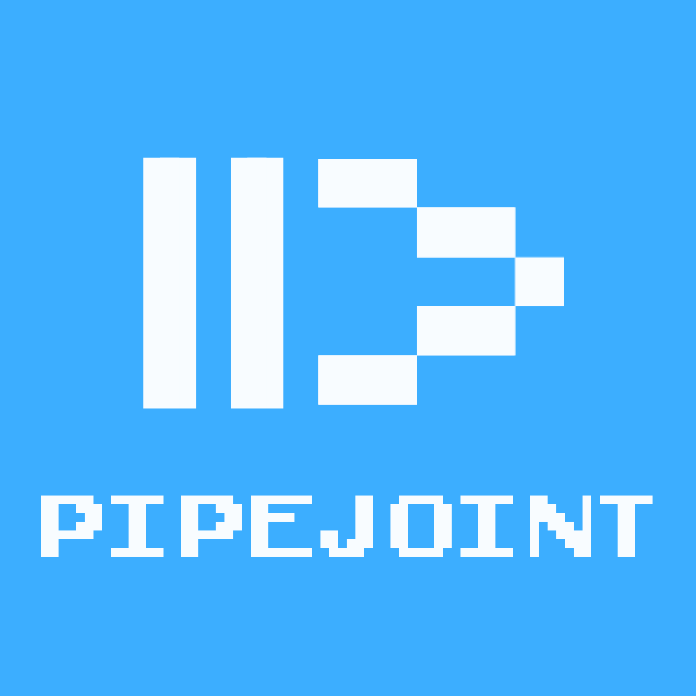
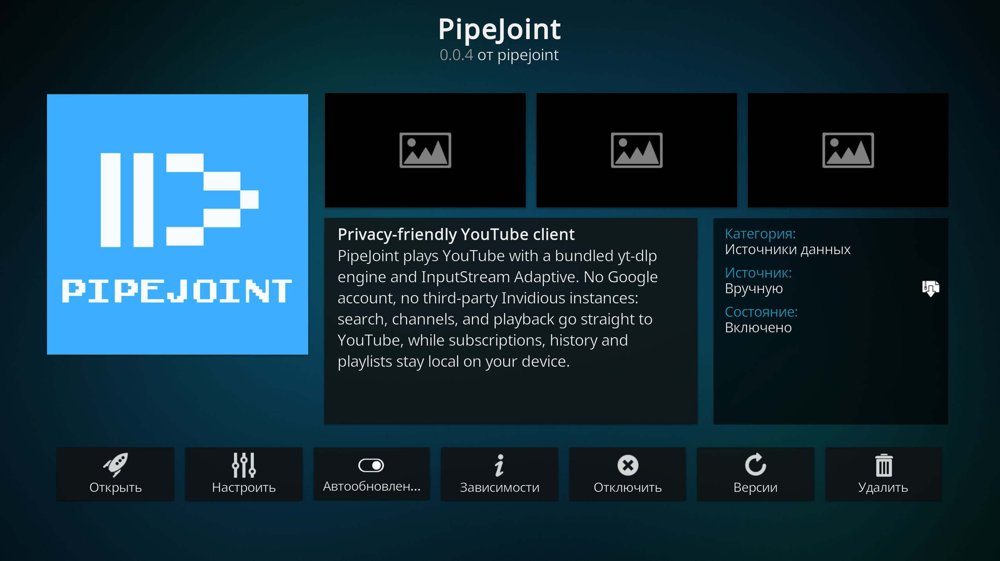
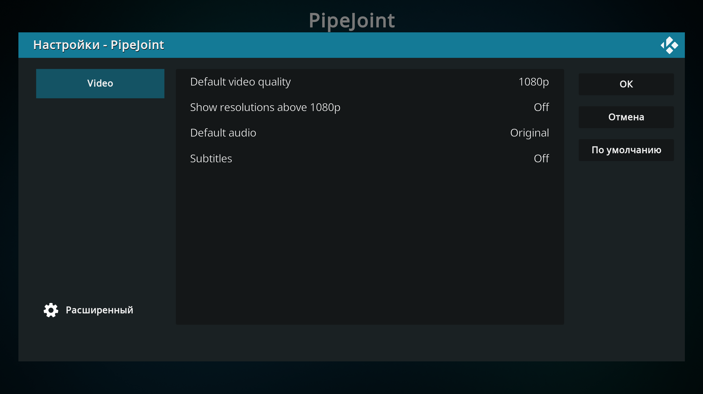
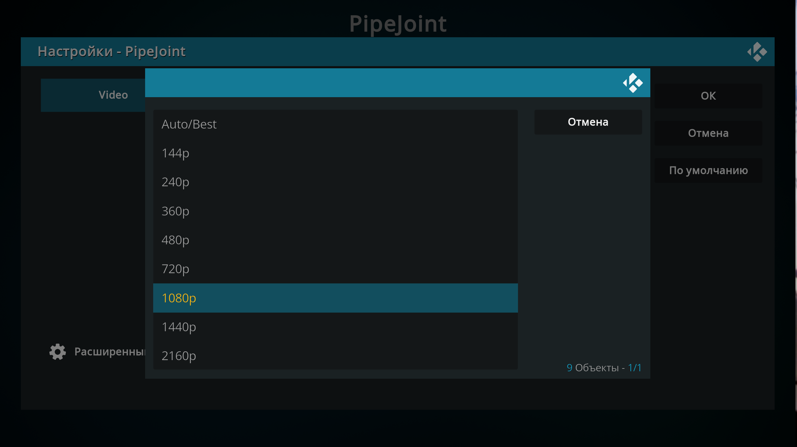
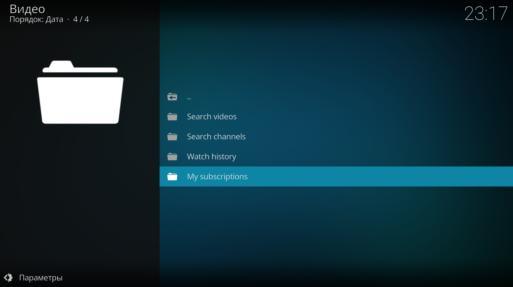
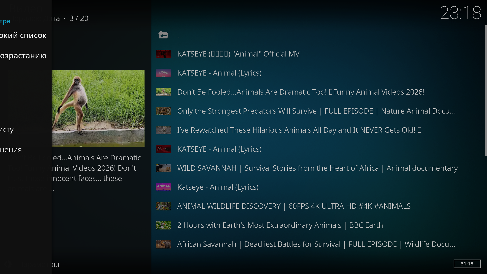
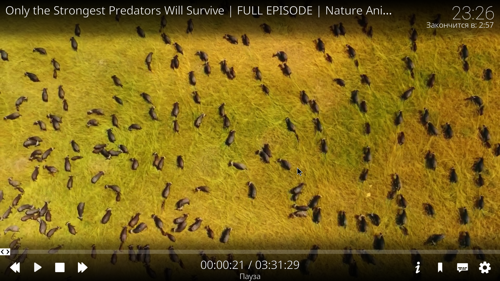

<div align="center">
  
  <h1>PipeJoint</h1>
  <p>Дружелюбный к приватности клиент YouTube для Kodi.</p>
</div>

<div align="center">

[](https://github.com/georgehuble/kodi-pipejoint-plugin/releases)
[](https://www.gnu.org/licenses/gpl-3.0.en.html)
[](https://github.com/georgehuble/kodi-pipejoint-plugin/actions/workflows/ci.yml)
[](https://kodi.tv)

</div>

[English](../README.md) | **Русский**

## Содержание

- [Статус beta](#статус-beta)
- [О дополнении](#о-дополнении)
- [Скриншоты](#скриншоты)
- [Возможности](#возможности)
- [Установка](#установка)
- [Настройки и использование](#настройки-и-использование)
- [Поддерживаемые сервисы](#поддерживаемые-сервисы)
- [Участие в разработке](#участие-в-разработке)
- [Релизы](#релизы)
- [Донаты](#донаты)
- [Лицензия](#лицензия)

## Статус beta

> [!WARNING]
> **PipeJoint находится в стадии beta.** Им пользуются каждый день, но он всё ещё активно
> развивается: **возможны ошибки и шероховатости**, а поведение может меняться от релиза к
> релизу. Обо всём, что сломалось, пишите в
> [трекер задач](https://github.com/georgehuble/kodi-pipejoint-plugin/issues).

## О дополнении

PipeJoint - дружелюбный к приватности клиент YouTube для Kodi. Он общается **напрямую с
YouTube** через встроенный движок [yt-dlp](https://github.com/yt-dlp/yt-dlp): никакого аккаунта
Google и никаких сторонних Invidious-инстансов:

- Поиск, страницы каналов и воспроизведение идут напрямую к YouTube.
- Подписки и истории хранятся **на вашем устройстве**; никуда не синхронизируются.
- Воспроизведение разрешается в progressive- или adaptive-поток (HLS/DASH) и передаётся
  **InputStream Adaptive** (`inputstream.adaptive`).

Поддерживаемое окружение:

| | |
| --- | --- |
| Kodi | 20 "Nexus" и новее |
| Проверено на | Kodi 21 "Omega" |
| Id дополнения | `plugin.video.pipejoint` |
| Версия | 0.0.1 (beta) |
| Лицензия | GPL-3.0-or-later |

## Скриншоты

Интерфейс дополнения англоязычный. Скриншоты сделаны в Kodi 21 "Omega".

|  |  |  |
| --- | --- | --- |
|  |  |  |
|  |  |  |

## Возможности

Каждая возможность ниже реализована и описана спецификациями проекта.

- **Поиск видео** - поиск по YouTube прямо из Kodi: результаты пригодны для воспроизведения
  и показываются с миниатюрами.
- **Недавние запросы** - поток поиска хранит недавние запросы (сначала новые, без дублей,
  максимум 20) и повторяет запрос одним нажатием. Отдельный запрос можно удалить, а весь
  список - очистить. Поиск каналов в историю не записывается.
- **Поиск каналов** - поиск каналов по названию; страница канала открывается прямо из
  результатов.
- **Страницы каналов** - действие «Подписаться/Отписаться» сверху, затем свежие загрузки
  канала по 50 штук с пунктом *More videos...* для следующей страницы.
- **Локальные подписки** - подписка со страницы канала, все подписки видны в разделе
  *My subscriptions*. Хранятся на устройстве: без аккаунта, без синхронизации и без сети для
  чтения списка.
- **История просмотров** - каждое воспроизведение записывается локально (сначала новые, без
  дублей); отдельную запись можно удалить, а всю историю - очистить.
- **Позиция возобновления** - позиция воспроизведения сохраняется при остановке, а при
  повторном запуске записи из истории предлагается продолжить с этого места (или начать
  сначала).
- **Выбор качества видео** - Auto/Best или конкретное качество для каждого видео через
  контекстное меню *Play with quality...*; выбранное качество держится всё воспроизведение.
  Качества выше 1080p появляются только после включения соответствующей настройки.
- **Аудио и субтитры по умолчанию** - выбор дорожки по умолчанию (Auto, Original или
  конкретный язык) и включение/выключение субтитров; применяется к каждому воспроизведению.
- **Хранение на устройстве** - подписки и обе истории лежат в собственном каталоге данных
  дополнения, без аккаунта и сетевой синхронизации.
- **Воспроизведение через InputStream Adaptive** - progressive- и adaptive-потоки (HLS/DASH)
  разрешаются встроенным движком yt-dlp и передаются в `inputstream.adaptive`.

## Установка

### Из опубликованного архива (рекомендуется)

1. Скачайте архив со [страницы релизов](https://github.com/georgehuble/kodi-pipejoint-plugin/releases)
   - для первого релиза это `kodi-pipejoint-plugin_v0.0.1.zip`. Распаковывать его **не нужно**.
2. В Kodi разрешите установку из zip-файлов: откройте **Настройки -> Система -> Дополнения** и
   включите **Неизвестные источники** (примите предупреждение).
3. Откройте **Дополнения -> Установить из zip-файла**, укажите скачанный
   `kodi-pipejoint-plugin_v0.0.1.zip` и подтвердите.
4. PipeJoint появится в разделе **Дополнения -> Видеодополнения**. Необходимую зависимость
   `inputstream.adaptive` Kodi установит из своего репозитория дополнений.

> [!NOTE]
> **Переустановка вместо обновления.** Если у вас уже есть dev-установка этого дополнения
> (например, собранная вручную `0.0.4`), ставьте релиз заново, а не обновляйте: Kodi не
> предлагает понижение версии, и более новая версия на диске иначе останется и продолжит
> работать по-старому.

### Установка для разработки

Установка из рабочей копии - скопируйте или склонируйте репозиторий в каталог дополнений Kodi
и перезапустите Kodi:

```shell
git clone https://github.com/georgehuble/kodi-pipejoint-plugin.git plugin.video.pipejoint
# затем скопируйте/свяжите его с каталогом дополнений Kodi, например:
#   flatpak Kodi: ~/.var/app/tv.kodi.Kodi/data/addons
#   classic Kodi: ~/.kodi/addons
```

Либо соберите установочный архив локально и установите его в Kodi из zip:

```shell
make dist        # -> kodi-pipejoint-plugin_v0.0.1.zip
```

Архив распаковывается в единственный каталог верхнего уровня с именем дополнения
`plugin.video.pipejoint/` - именно этого ждёт Kodi.

## Настройки и использование

Дополнение открывается таким главным меню:

| Пункт | Что делает |
| --- | --- |
| Search videos | Открывает поток поиска: действие **New search...** и недавние запросы, сначала новые. Выбор запроса повторяет его; контекстное меню удаляет один запрос или очищает всю историю. |
| Search channels | Поиск каналов по названию. Открытие результата показывает страницу этого канала. |
| Watch history | Просмотренные видео, сначала новые. Выбор записи запускает её повторно и предлагает продолжить с сохранённой позиции, если она есть; контекстное меню запускает с начала, удаляет запись или очищает историю. |
| My subscriptions | Каналы, на которые вы подписаны, сначала новые. Открытие показывает страницу канала. |

### Настройки

| Настройка | Значения | По умолчанию | Что делает |
| --- | --- | --- | --- |
| Default video quality | Auto/Best, 144p, 240p, 360p, 480p, 720p, 1080p, 1440p, 2160p | 720p | Качество, используемое, когда для видео не выбрано своё. |
| Show resolutions above 1080p | Off / On | Off | Добавляет 1440p и 2160p в список качеств. |
| Default audio | Auto, Original или тег языка | Original | Аудиодорожка, запрашиваемая при старте воспроизведения. |
| Subtitles | Off / On | Off | Подключает субтитры видео, чтобы они появлялись в плеере. |

### Выбор качества для конкретного видео

Выделите видео, откройте контекстное меню и выберите **Play with quality...**, затем укажите
Auto/Best или конкретное качество. Конкретный выбор держится всё воспроизведение (плеер не
начинает с меньшего качества и не поднимается позже, и никогда не превышает выбранное);
Auto/Best оставляет адаптивное переключение без ограничения.

Настройки аудио и субтитров - это дополнительные предпочтения: они никогда не блокируют и не
прерывают воспроизведение.

## Поддерживаемые сервисы

| Сервис | Статус |
| --- | --- |
| YouTube | Поддерживается - поиск видео, поиск каналов, страницы каналов и воспроизведение идут напрямую к `youtube.com`. |

PipeJoint работает только с YouTube. Он обращается к YouTube напрямую через встроенный движок
yt-dlp, поэтому не зависит от Invidious-инстансов (многие из которых сегодня ограничивают свой
API) и не требует аккаунта Google.

## Участие в разработке

Задачи и pull request'ы приветствуются в
[трекере задач](https://github.com/georgehuble/kodi-pipejoint-plugin/issues). Держите изменения
небольшими и на английском языке - это касается спецификаций, подписей интерфейса и
документации.

Изменения поведения начинаются как OpenSpec-изменение в [`openspec/changes/`](../openspec/changes);
источник истины - спецификации в [`openspec/specs/`](../openspec/specs). Перед pull request'ом
запустите те же проверки, что и CI:

```shell
ruff check .
mypy .
for test_script in tests/test_*.py; do python3 "$test_script"; done
```

```text
default.py                  роутер дополнения (меню, поиск, каналы, воспроизведение)
resources/lib/
  resolver.py               разрешение потоков через yt-dlp (progressive/HLS), без xbmc
  ytlib.py                  каталог: поиск видео и каналов, без xbmc
  store.py                  локальные подписки и истории, без xbmc
  player_monitor.py         отслеживание позиции для истории просмотров
  settings.xml              настройки дополнения
  yt_dlp/                   встроенный движок yt-dlp
tests/                      desktop- и Kodi-shim-тесты (Kodi для запуска не нужен)
.github/workflows/          ci.yml (проверки) и release.yml (релиз по тегу)
openspec/                   спецификации и текущие изменения
```

`resolver.py`, `ytlib.py` и `store.py` намеренно не импортируют `xbmc*`, чтобы их можно было
прогонять на обычном десктопе.

## Релизы

Каждая опубликованная версия - это GitHub Release с прикреплённым установочным архивом:
**[страница релизов](https://github.com/georgehuble/kodi-pipejoint-plugin/releases)**. Бейджи
в начале документа показывают последний релиз и текущий статус CI.

Релизы отрезаются по тегам версий (`v0.0.1`), и тег всегда совпадает с версией, объявленной в
[`addon.xml`](../addon.xml). Релиз, у которого тег и манифест расходятся, не публикуется.

## Донаты

PipeJoint - свободное ПО, которое развивается в свободное время. Если оно вам полезно, донаты
приветствуются.

| Сеть | Адрес |
| --- | --- |
| Bitcoin (BTC) | `bc1qejp32veu4de2rd7smup76dmsxrakss7vf2ws4s` |
| Ethereum | `0x9372380E235Db79D597b1C227056990403829fcA` |
| BNB Chain | `0x9372380E235Db79D597b1C227056990403829fcA` |
| Polygon | `0x9372380E235Db79D597b1C227056990403829fcA` |
| Solana (SOL) | `AmwjXAGMzLRB7qi6KPsMWo2X47FGumLfevCioqVG3yTm` |
| Tron (TRX) | `TgnudM17V9XvNmrzSdBZxapESgQyY63jaL` |

Адрес Ethereum - это общий EVM-адрес: один и тот же адрес принимает средства в сетях
**Ethereum**, **BNB Chain** и **Polygon**, поэтому он указан по разу для каждой сети. Отправляйте
средства только в той сети, которая указана рядом с адресом.

## Лицензия

PipeJoint распространяется под лицензией **GNU General Public License v3.0 или новее**
(GPL-3.0-or-later) - см. [`LICENSE`](../LICENSE). PipeJoint основан на коде под лицензией MIT, и
эта атрибуция сохранена в соответствующих заголовках исходников.
